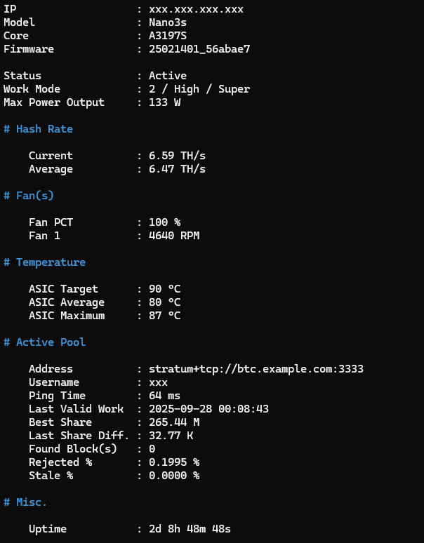

# Toolset Documentation

## PowerShell 7 IS REQUIRED.

All the free tools are written using PowerShell 7.

PowerShell 7 is free and can be installed on Windows, Linux, macOS & more.

[Install PS7](https://learn.microsoft.com/en-us/powershell/scripting/install/installing-powershell)

## Common parameters & what they mean

| Parameter        |   Type | Explanation                                                     |
|------------------|-------:|-----------------------------------------------------------------|
| `-MinerIP`       | string | IPv4 of the miner (e.g. `192.168.1.236`).                       |
| `-MinerPassword` | string | Miner web/admin password (plain text) — required for `setpool`. |
| `-PoolID`        |    int | Pool index: **0..2** on this Avalon firmware.                   |
| `-PoolURL`       | string | `stratum+tcp://host:port` (no commas!).                         |
| `-PoolUsername`  | string | Worker/user for the pool.                                       |
| `-PoolPassword`  | string | Pool worker password.                                           |
| `-PoolPriority`  | string | Comma-separated list of pool indices, e.g. `0,1,2` or `1,0`.    |

Default cgminer API port used by scripts: **4028**. If you changed the miner’s API port, update the script or helper.


## Main Scripts

### `Show-AvalonMinerInfo`

Output detailed information about an Avalon miner.

Command Example:

```powershell
.\Show-AvalonMinerInfo.ps1 -MinerIP 192.168.1.236

```

Output Example:




### `Show-AvalonMinerVersion`

Output HW & SW version information about an Avalon miner.

Command Example:

```powershell
.\Show-AvalonMinerVersion.ps1 -MinerIP 192.168.1.236

```

Output Example:


## HW Config Scripts

### `Set-AvalonMinerFanSpeed`

Set the fan speed of an Avalon miner via the ascset API. USE AT YOUR OWN RISK(S).

Examples:

```powershell

# Auto mode: let device auto-adjust (default)
.\Set-AvalonMinerFanSpeed -MinerIP '192.168.1.100' -Mode Auto

# Exact mode: set the fan to 80%
.\Set-AvalonMinerFanSpeed -MinerIP '192.168.1.100' -Mode Exact -Speed 80

# Range mode: set allowed range 30..100
.\Set-AvalonMinerFanSpeed -MinerIP '192.168.1.100' -Mode Range -MinSpeed 30 -MaxSpeed 100

```

---

### `Restart-AvalonMiner`

Reboot an Avalon miner.

Allow a delay in seconds before executing the reboot command.

Default is 0. Maximum is 300 seconds.

Examples:

```powershell

# Reboot immediately:
.\Restart-AvalonMiner.ps1 -MinerIP 192.168.0.236

# Reboot with 10 second delay:
.\Restart-AvalonMiner.ps1 -MinerIP 192.168.0.236 -DelaySeconds 10

```


## Pool(s) Scripts

### `Show-AvalonMinerPoolConfig`

List configured pools & statistics.

Example:

```powershell
.\Show-AvalonMinerPoolConfig.ps1 -MinerIP 192.168.1.236
```

---

### `Set-AvalonMinerPoolConfig`

Set (replace) a pool entry. **Authentication required**: provide the miner web/admin password (plain text).

Example:

```powershell
.\Set-AvalonMinerPoolConfig.ps1 `
  -MinerIP 192.168.0.236 `
  -MinerPassword 'device admin password' `
  -PoolID 2 `
  -PoolURL 'stratum+tcp://example.com:333' `
  -PoolUsername 'myworker' `
  -PoolPassword 'mypoolpass'
```

**Notes**

* `MinerPassword` is the miner **web/admin password** (plain), not the hashed form.
* `PoolID` on this firmware is limited to `0`, `1`, or `2`.
* A successful response will instruct you to **reboot** the miner; do so for changes to apply.

---

### `Set-AvalonMinerActivePool`

Switch the active pool (equivalent to `switchpool <index>`).

Example:

```powershell
.\Set-AvalonMinerActivePool.ps1 -MinerIP 192.168.0.236 -PoolID 1
```

---

### `Enable-AvalonMinerPool`

Enable a configured pool index.

Example:

```powershell
.\Enable-AvalonMinerPool.ps1 -MinerIP 192.168.0.236 -PoolID 0
```

---

### `Disable-AvalonMinerPool`

Disable a configured pool index.

Example:

```powershell
.\Disable-AvalonMinerPool.ps1 -MinerIP 192.168.0.236 -PoolID 1
```

> Warning: the firmware rejects disabling the *last active* pool.

---

### `Set-AvalonMinerPoolPriority`

Set pool priority ordering. Provide a comma separated list of pool indices; the order you give becomes new priority order.

Examples:

Set Default Pool => `1`, Backup => `0`, disable/change priority of `2`:

```powershell
.\Set-AvalonMinerPoolPriority.ps1 -MinerIP 192.168.0.236 -PoolPriority '1,0'
```

Set Default Pool => `0`, Backups => `1` and `2` (0 highest priority):

```powershell
.\Set-AvalonMinerPoolPriority.ps1 -MinerIP 192.168.0.236 -PoolPriority '0,1,2'
```


## MISC. Scripts

### `Reset-AvalonMinerFilterClean`

Reset the filter clean reminder on an Avalon miner.

Example:

```powershell

.\Reset-AvalonMinerFilterClean -MinerIP '192.168.1.100'

```
